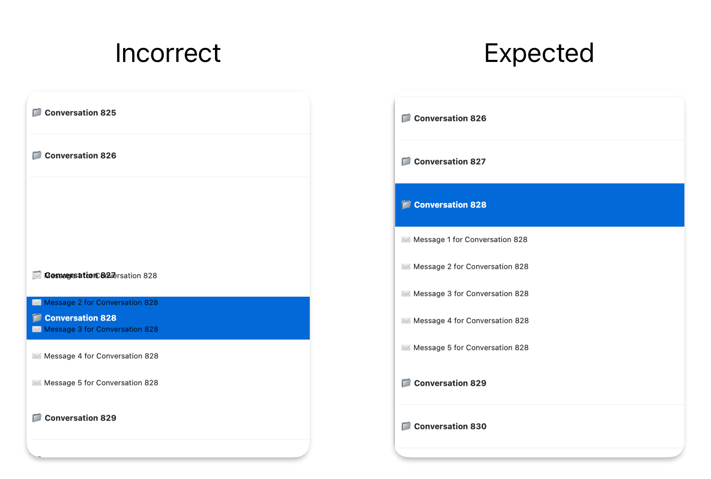

# NSTableView batch update issue

Using `beginUpdates/endUpdates` do the insert/remove update with animation.
```swift
displayItems = newDisplayItems

tableView.beginUpdates()

tableView.removeRows(at: IndexSet(removeIndex), withAnimation: [.effectFade, .slideUp])
tableView.insertRows(at: IndexSet(insertIndex), withAnimation: [.effectFade, .slideDown])

tableView.endUpdates()
```

Usually it works, but sometimes the UI broken, reproduce steps:
1. Prepare large data, for example 1000 items.
2. Init table view, should show the first row in first tiem.
3. In `viewDidAppear` call `scrollRowToVisible` to scroll to the bottom.
4. Scroll up a few rows and tap one row to expand.

Results:
The batch update UI broken

